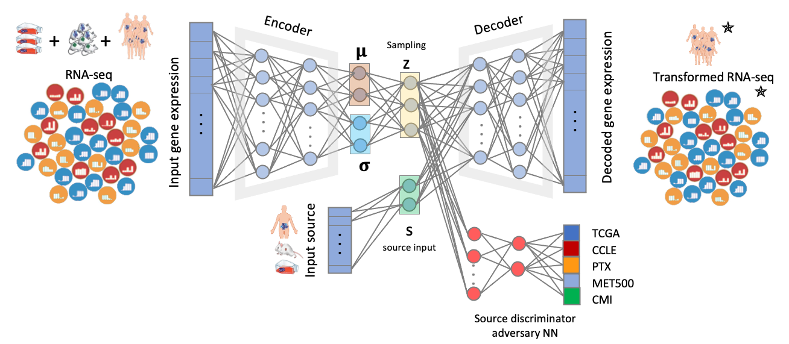

**MOBER** (<u>M</u>ulti <u>O</u>rigin <u>B</u>atch <u>E</u>ffect <u>R</u>emover) is a deep learning-based method that performs biologically relevant integration of transcriptional profiles from pre-clinical models and clinical tumors. MOBER can be used to guide the selection of cell lines and patient-derived xenografts and identify models that more closely resemble clinical tumors. We applied MOBER on transcriptional profiles from 932 cancer cell lines, 442 patient-derived xenografts and 11205 clinical tumors and identified pre-clinical models with greatest transcriptional fidelity to clinical tumors, and models that are transcriptionally unrepresentative of their respective clinical tumors. MOBER is interpretable by design, therefore allowing drug hunters to better understand the underlying biological differences between models and patients that are responsible for the observed lack of clinical translatability. 
MOBER can remove batch effects between any transcriptomics datasets of different origin while conserving relevant biological signals.

 


See our latest [manuscript](https://doi.org/10.1101/2022.09.07.506964) and check our [web app](https://mober.pythonanywhere.com/) where the aligned data on cancer cell lines, patient-derived xenografts and clinical tumors can be explored interactively. 
  
  
### Installing MOBER
1. cuda and pytorch
Find cuda available cuda version with `module avail cuda`. Install [Pytorch](https://pytorch.org/) according the the latest cuda version you found. 

2. Install mober
```linux
git clone https://github.com/Novartis/mober.git
cd mober
pip install -e .
```

Check if it is successfully installed: run `mober --help` in the terminal from any directories. 
  
  
### 1. Preparing input h5ad file for training
The input file should be in [anndata](https://anndata.readthedocs.io/en/latest/) format and saved as h5ad. In the file, the column "**data_source**" that specifies the batch ID of samples in the sample annotation `.obs` is **required**. The h5ad file can be generated in two ways:

##### 1.1 For R users:
```R
Save a seurat obj to h5ad, with 'data_source' as a column in meta
```

##### 1.2 For Python users:
```python
import scanpy as sc
from scipy.sparse import csr_matrix
# X, expression matrix, samples x genes
# sampInfo, pd.DataFrame, with 'data_source' as one of the columns, and sample IDs as index
# geneInfo, pd.DataFrame, with gene ids as index
# X, sampInfo, geneInfo should be matched, in terms of sample order and gene order.
adata = sc.AnnData(csr_matrix(X),obs=sampInfo,var=geneInfo)
adata.write('name.h5ad')
```
  
  
### 2. Train MOBER
```linux
mober train \
--train_file input.h5ad \
--output_dir ../tmp_data/test
```
In this case, the trained model will be in `../tmp_data/test/models` and the training metrics and parameters used for training are in `../tmp_data/test/metrics`, in tsv format.

  
### 3. Do projection
Once the model is trained, the projection can be done in two different ways:
#### 3.1. through command line
```linux
mober projection \
--model_dir path_to_where_models_and_metrics_folders_are/models \
--onto TCGA \#  should be one of batch IDs used in training.
--projection_file input.h5ad \
--output_file outname.h5ad \
--decimals 4
```

#### 3.2 within python scripts, as projection step is fast and does not need GPU.
```python
from mober.core.projection import load_model, do_projection
import scanpy as sc
import torch

model_dir = 'path_to_where_models_and_metrics_folders_are/models'
device = torch.device("cuda" if torch.cuda.is_available() else "cpu")
adata = sc.read('projection_file.h5ad')
model, features, label_encode = load_model(model_dir, device)
adata = adata[:,features]

proj_adata, z_adata = do_projection(model,adata, onto, label_encode, device, batch_size=1600)
proj_adata.write('outname.h5ad')

# proj_adata contains the projected values.
# z_adata contains the sample embeddings in the latent space

```
  
  
### Get help about input arguments
1. Train
```linux
mober train --help
```

2. Projection
```linux
mober projection --help
```
  
  
### Use GPU on HPC, minimal script
Copy and modify following content in a text file, e.g. `sub.sh`, then run `qsub sub.sh` to submit the job to HPC.
```linux
#!/bin/bash
#$ -cwd
#$ -S /bin/bash
#$ -l m_mem_free=32G
#$ -l h_rt=24:00:00
#$ -l gpu_card=4
#$ -m e
#$ -M your@email.com
#$ -N mober
#$ -o running.log
#$ -e error.log
#$ -V
#$ -b n


conda activate yourENV
module module load cuda10.2/fft/10.2.89  # Found by module avail cuda

mober train \
--train_file path/to/your/input.h5ad \
--output_dir output_path

```

## License

This project is licensed under the terms of MIT License.  
Copyright 2022 Novartis International AG.

    
## Reference

If you use MOBER in your research, please consider citing our [manuscript](https://doi.org/10.1101/2022.09.07.506964),

```
@article {Dimitrieva2022.09.07.506964,
	author = {Dimitrieva, Slavica and Janssens, Rens and Li, Gang and Szalata, Artur and Gopal, Raja and Parmar, Chintan and Kauffmann, Audrey and Durand, Eric Y.},
	title = {Biologically relevant integration of transcriptomics profiles from cancer cell lines, patient-derived xenografts and clinical tumors using deep learning},
	elocation-id = {2022.09.07.506964},
	year = {2022},
	doi = {10.1101/2022.09.07.506964},
	publisher = {Cold Spring Harbor Laboratory},
	URL = {https://www.biorxiv.org/content/10.1101/2022.09.07.506964v2,
	eprint = {https://www.biorxiv.org/content/10.1101/2022.09.07.506964v2.full.pdf},
	journal = {bioRxiv}
}
```

